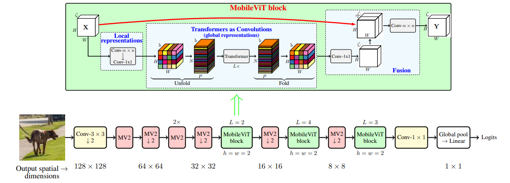

# MobileViT

***

> [MobileViT：Light-weight, General-purpose, and Mobile-friendly Vision Transformer](https://arxiv.org/pdf/2110.02178.pdf)

## Introduction

***

 MobileViT, a light-weight and general-purpose vision transformer for mobile devices. MobileViT presents a different perspective for the global processing of information with transformers, i.e., transformers as convolutions. MobileViT significantly outperforms CNN- and ViT-based networks across different tasks and datasets. On the ImageNet-1k dataset, MobileViT achieves top-1 accuracy of 78.4% with about 6 million parameters, which is 3.2% and 6.2% more accurate than MobileNetv3 (CNN-based) and DeIT (ViT-based) for a similar number of parameters. On the MS-COCO object detection task, MobileViT is 5.7% more accurate than MobileNetv3 for a similar number of parameters.




## Benchmark

***

|        |                   |           |           |    Pynative     |  Pynative  |     Graph      |   Graph    |          |        |
| :----: | ----------------- | :-------: | :-------: | :-------------: | :--------: | :------------: | :--------: | :------: | :----: |
|        | Model             | Top-1 (%) | Top-5 (%) | train (s/epoch) | Infer (ms) | train(s/epoch) | Infer (ms) | Download | Config |
|  GPU   | mobilevit_xxs     |           |           |                 |            |                |            |          |        |
| Ascend | mobilevit_xxs     |           |           |                 |            |                |            |          |        |
|  GPU   | mobilevit_xs      |           |           |                 |            |                |            |          |        |
| Ascend | mobilevit_xs      |           |           |                 |            |                |            |          |        |
|  GPU   | mobilevit_s       |           |           |                 |            |                |            |          |        |
| Ascend | mobilevit_s       |           |           |                 |            |                |            |          |        |


## Examples

***

### Train

- The [yaml config files](../../config) that yield competitive results on ImageNet for different models are listed in the `config` folder. To trigger training using preset yaml config. 

  ```shell
  export CUDA_VISIBLE_DEVICES=0,1,2,3,4,5,6,7
  mpirun -n 8 python train.py -c config/mobilevit/mobilevit_xxs_gpu.yaml --data_dir /path/to/imagenet
  ```


- Here is the example for finetuning a pretrained mobilevit_xxs on CIFAR10 dataset using Adam optimizer.

  ```shell
  python train.py --model=mobilevit_xxs --pretrained --opt=momentum --lr=0.001 dataset=cifar10 --num_classes=10 --dataset_download
  ```

Detailed adjustable parameters and their default value can be seen in [config.py](../../config.py).

### Eval

- To validate the model, you can use `validate.py`. Here is an example for mobilevit_xxs to verify the accuracy of pretrained weights.

  ```shell
  python validate.py --model=mobilevit_xxs --dataset=imagenet --val_split=val --pretrained
  ```

- To validate the model, you can use `validate.py`. Here is an example for mobilevit_xxs to verify the accuracy of your training.

  ```python
  python validate.py --model=mobilevit_xxs --dataset=imagenet --val_split=val --ckpt_path='./ckpt/mobilevit.ckpt'
  ```

